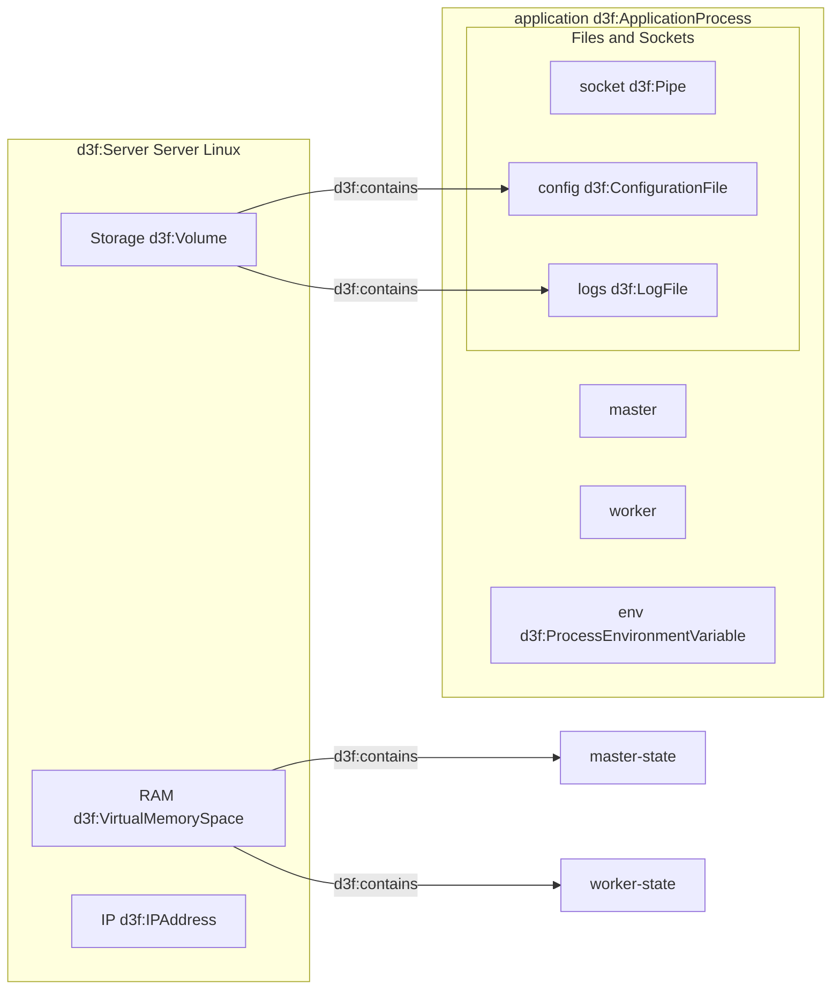
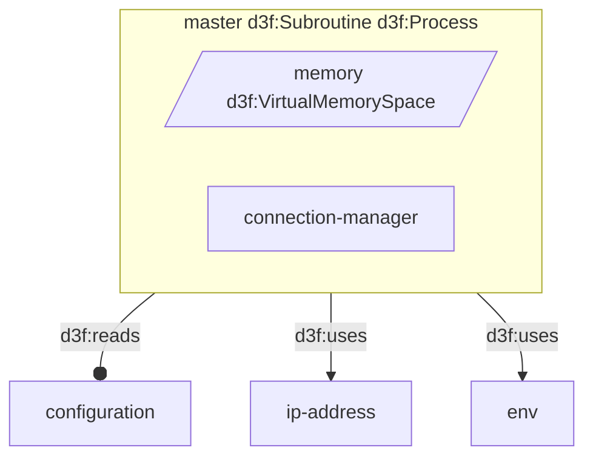
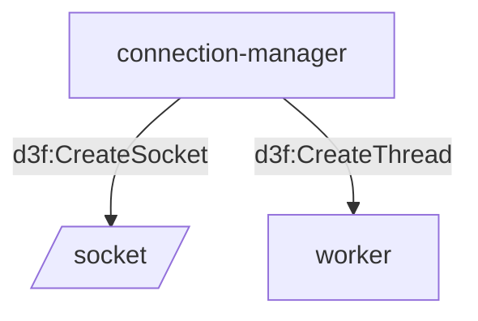
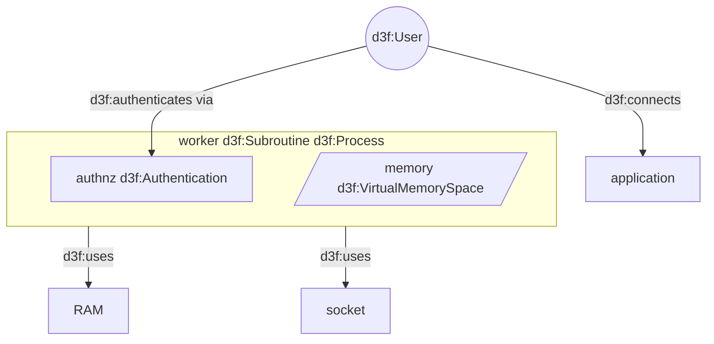

# A server application

## Architecture

The following diagram shows the architecture of a server application,
running on a Linux server with RAM, storage, and an IP address.

The application process has a master process and various worker processes,
and relies on environment variables, configuration files, and log files.

## Master process

The master process reads the configuration, manages connections and
binds to an IP address.

Moreover the connection manager assigns a worker thread for each connection,
eventually creating new threads and sockets as needed.

## Worker process

The worker process uses the configuration read by the master process,
and the sockets created by the connection manager.

The worker process authenticates the user, and then processes the data stream.

