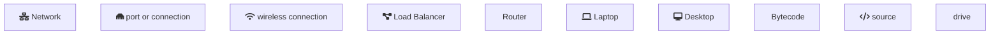

```mermaid

graph

network[fa:fa-network-wired Network]
ethernet[fa:fa-ethernet port or connection]
wireless[fa:fa-wifi wireless connection]


balancer[fa:fa-diagram-project Load Balancer]
router[fa:fa-router Router]
laptop[fa:fa-laptop Laptop]
desktop[fa:fa-desktop Desktop]

source[fa:fa-file-binary Bytecode]
bytecode[fa:fa-code source]

drive[fa:fa-disc-drive drive]


```
