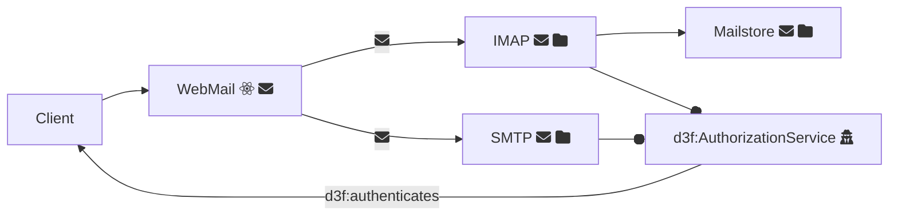

# This is a diagram document

```mermaid
graph LR

%% Design here your architecture using MermaidJS syntax.

%% The simple arrow maps to d3f:accesses
Client --> WebMail

%% Font-awesome icons can be used to indicate that
%%   a node is a class (e.g. fa-react maps to a WebUI)
WebMail[WebMail fab:fa-react fa:fa-envelope]

%% Font-Awesome icons can indicate that a node
%%   accesses specific resources
%%   (e.g. fa-envelope represent a d3f:Email)
WebMail -->|fa:fa-envelope| IMAP[IMAP fa:fa-envelope fa:fa-folder]
WebMail -->|fa:fa-envelope| SMTP[SMTP fa:fa-envelope fa:fa-folder]
IMAP --> Mailstore[Mailstore fa:fa-envelope fa:fa-folder]

%% Associated d3f:DigitalArtifacts can be referenced via URIs too.
Authorization[d3f:AuthorizationService fa:fa-user-secret] --> |d3f:authenticates| Client
IMAP --o Authorization
SMTP --o Authorization
```
