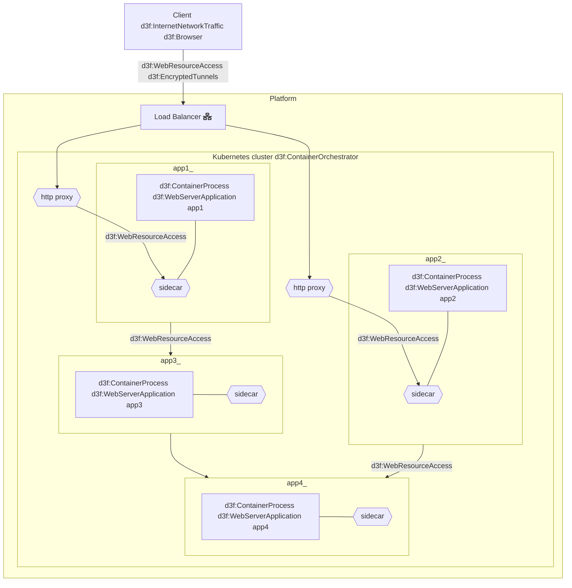

# A network with service mesh

```mermaid
graph

%% A client from Internet.
client[Client d3f:InternetNetworkTraffic d3f:Browser]

%% The client connects to a Load Balancer.
lb[Load Balancer fa:fa-network-wired]

client -->|"d3f:WebResourceAccess d3f:EncryptedTunnels"| lb

%% The Load Balancer routes the traffic to a Service Mesh.

lb --> nginx1 & nginx2

nginx1{{http proxy}}
nginx2{{http proxy}}

%% The Service Mesh routes the traffic to the application.

nginx1 -->|d3f:WebResourceAccess| sidecar1
nginx2 -->|d3f:WebResourceAccess| sidecar2

%% The application is made up of various APIs

app1_ -->|d3f:WebResourceAccess| app3_ --> app4_
app2_ -->|d3f:WebResourceAccess| app4_

subgraph app1_
    app1[d3f:ContainerProcess d3f:WebServerApplication app1] --- sidecar1{{sidecar}}
end

subgraph app2_
    app2[d3f:ContainerProcess d3f:WebServerApplication app2] --- sidecar2{{sidecar}}
end

subgraph app3_
    app3[d3f:ContainerProcess d3f:WebServerApplication app3] --- sidecar3{{sidecar}}
end

subgraph app4_
    app4[d3f:ContainerProcess d3f:WebServerApplication app4] --- sidecar4{{sidecar}}
end

subgraph kube[Kubernetes cluster d3f:ContainerOrchestrator]
    app1_  & app2_ & app3_ & app4_
    nginx1 & nginx2
end

subgraph Platform
    kube
    lb
end

```
