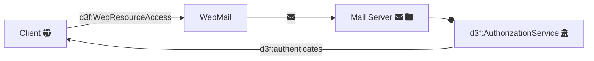
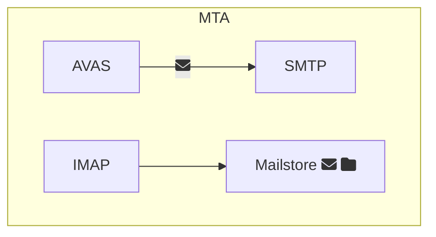
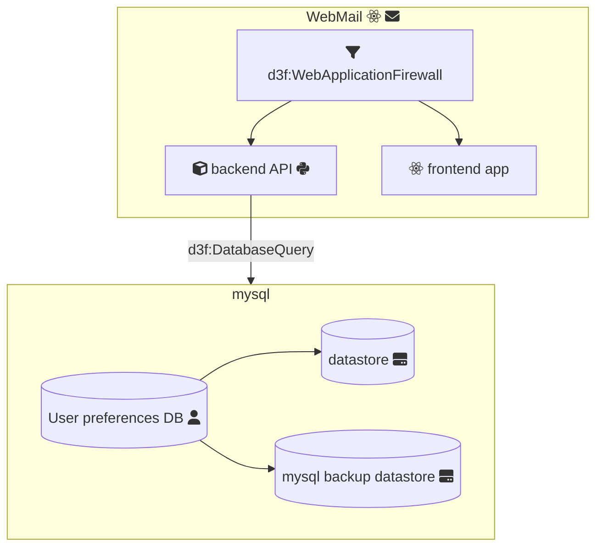
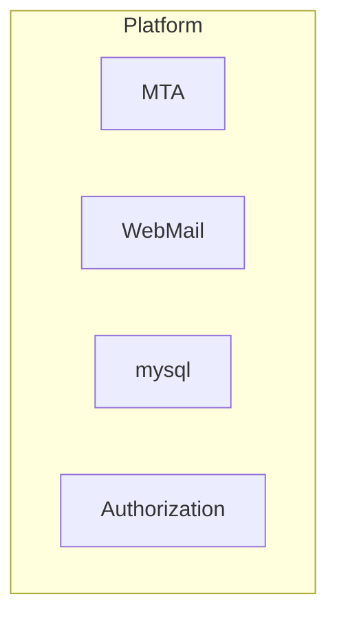

# A simple webmail architecture

```mermaid
graph LR

%% 1. Design here your architecture using MermaidJS syntax.
%% 2. Click on the "D3FEND" tab to see the possible attack paths.
%% 3. Explore the other features selecting the other tabs!

%% The simple arrow maps to d3f:accesses
Client[Client fa:fa-globe] --> |d3f:WebResourceAccess| WebMail

%% Font-Awesome icons can indicate that a node
%%   accesses specific resources
%%   (e.g. fa-envelope represent a d3f:Email)
WebMail -->|fa:fa-envelope| MTA[Mail Server fa:fa-envelope fa:fa-folder]

%% Associated d3f:DigitalArtifacts can be referenced via URIs too.
Authorization[d3f:AuthorizationService fa:fa-user-secret] --> |d3f:authenticates| Client
MTA --o Authorization

```

## More details on the Mail Architecture

```mermaid

graph

subgraph MTA
AVAS -->|fa:fa-envelope| SMTP
IMAP --> Mailstore[Mailstore fa:fa-envelope fa:fa-folder]
end
```

## Webmail Architecture

```mermaid
graph

%% The webapp has a database for user settings.
be --> |d3f:DatabaseQuery| mysql

%% Font-awesome icons can be used to indicate that
%%   a node is a class (e.g. fa-react maps to a WebUI)
subgraph WebMail[WebMail fab:fa-react fa:fa-envelope]
    fe[fab:fa-react frontend app]
    be[fa:fa-cube  backend API fab:fa-python]
    waf[fa:fa-filter d3f:WebApplicationFirewall] --> fe & be
end

subgraph mysql
    db[(User preferences DB fa:fa-user)]
    db --> db-datastore[(datastore fa:fa-hard-drive)]
    %% Protect mysql from disk content wipe
    db --> db-backup[(mysql backup datastore fa:fa-hard-drive)]

end

```

## Containerized Webmail Architecture

```mermaid

graph

%% Containerized application
subgraph Platform
MTA
WebMail
mysql
Authorization
end

```
